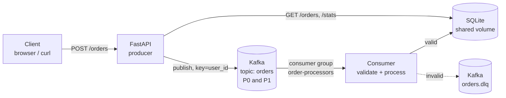

# OrderStream

A Kafka-based, event-driven order processing pipeline, containerised with Docker Compose, tested with pytest, and validated by a GitHub Actions CI pipeline. The stack is also prepared for optional deployment to AWS EC2 (not currently deployed).


## What it does

A client places an order over HTTP. The API does **not** talk to the processor directly. It publishes an `OrderCreated` event to Apache Kafka, and a separate consumer service reads the event, validates it, and stores it in SQLite. Producer and consumer are decoupled: either can be restarted or scaled independently, while Kafka retains events until they are consumed.

## Architecture



The whole system runs as four Docker Compose services. It runs locally today, and the same stack is prepared to run on a single EC2 instance (see the optional deployment section below; it is not currently deployed):

| Service | Image | Role |
|---|---|---|
| `kafka` | `apache/kafka:3.8.0` | Single broker in KRaft mode (no ZooKeeper). Bound to localhost only. |
| `kafka-init` | `apache/kafka:3.8.0` | One-shot job that creates `orders` (2 partitions) and `orders.dlq` |
| `api` | `orderstream` | FastAPI: accepts orders, publishes to Kafka, serves reads and the dashboard |
| `consumer` | `orderstream` (same image) | Reads events, stores them, dead-letters bad ones |

The API and consumer share the `orders-db` Docker volume, which is how the API can read what the consumer wrote.

## Distributed-systems concepts demonstrated

- **Message passing / decoupling**: producer and consumer only know the topic, not each other.
- **Partitioning and ordering**: events are keyed by `user_id`. Kafka guarantees order *within* a partition, so all orders from one user are processed in sequence. There is no global ordering across partitions.
- **Consumer groups**: run 2 consumers and Kafka splits the 2 partitions between them (horizontal scaling).
- **Delivery guarantees**: the producer uses `acks=all` and idempotence. The consumer commits the offset only *after* storing the order (at-least-once), and the insert is idempotent (`INSERT OR IGNORE`), so redelivery never creates duplicates.
- **Failure handling**: malformed events go to a dead-letter topic instead of blocking the queue. If the DB is unavailable the consumer exits without committing, Docker restarts it, and Kafka redelivers. If Kafka is down the API returns `503`.

## API

| Method | Path | Description |
|---|---|---|
| `GET` | `/` | Live dashboard (send orders, watch them flow through partitions) |
| `POST` | `/orders` | Publish an order. Returns `202` with the Kafka partition and offset |
| `GET` | `/orders?limit=50` | Processed orders |
| `GET` | `/orders/{order_id}` | One order (`404` until the consumer has processed it) |
| `GET` | `/stats` | Order count, revenue, orders per partition |
| `GET` | `/health` | Liveness check |
| `GET` | `/docs` | Swagger UI |

Example:

```bash
curl -X POST http://localhost:8000/orders \
  -H "Content-Type: application/json" \
  -d '{"user_id":"U-101","amount":1499,"items":["Keyboard","Mouse"]}'
```

## Run locally

Requires Docker with the Compose plugin.

```bash
git clone https://github.com/pranshu-dhyani145/OrderStream.git
cd OrderStream
docker compose up -d --build
```

Open http://localhost:8000, or run `./scripts/demo.sh` to fire a batch of orders. Watch the consumer with `docker compose logs -f consumer`.

Scale the consumers to see partitions being split:

```bash
docker compose up -d --scale consumer=2
docker compose logs -f consumer
```

Reset everything (Kafka data and DB): `docker compose down -v`.

## Tests

```bash
python -m venv .venv && source .venv/bin/activate   # Windows: .venv\Scripts\activate
pip install -r requirements-dev.txt
ruff check .
pytest -v
```

18 tests cover model validation, the producer (key, topic, broker failure), the consumer (valid, invalid, duplicate, dead-letter), the database, and the API (`202`, `422`, `503`, `404`). Kafka is replaced by a fake producer, so tests run in under a second with no broker.

## CI/CD (GitHub Actions)

`.github/workflows/ci-cd.yml` runs on every push and pull request to `main`:

```
push / pull request
      |
    test  (ruff check + pytest)
      |   (only if test passes)
  docker-build  (docker compose config + docker build)
```

The workflow needs no cloud credentials and finishes green when lint, tests and the Docker build pass.

Deployment is **not** part of this pipeline. An optional, manual-only workflow (`.github/workflows/deploy-ec2.yml`) exists for EC2; it never runs on push or PR, and if the EC2 secrets are missing it exits with a notice instead of failing.

### Blocking merges when tests fail

Configure once in GitHub: **Settings -> Branches -> Add branch protection rule** for `main`:

1. Require a pull request before merging
2. Require status checks to pass before merging, then select **`test`** and **`docker-build`** (they appear in the list after the workflow has run once)
3. Save

Now a failing test turns the PR check red and the merge button is disabled, so broken code cannot reach `main`.

## Optional: deploy to AWS EC2 (prepared, not currently deployed)

This project is **not** currently deployed to AWS. Everything above works locally with Docker Compose. The steps below are for anyone who wants to host the same stack on EC2.

1. **Launch an instance**: Ubuntu 24.04 LTS, `t3.small` (2 GB RAM; Kafka is tight on 1 GB), 15 GB disk.
2. **Security group inbound rules**: `22` (SSH, ideally your IP only) and `8000` (HTTP for the API). Do **not** open 9092 or 9093.
3. **Install and start** (SSH in first):
   ```bash
   curl -fsSL https://raw.githubusercontent.com/pranshu-dhyani145/OrderStream/main/scripts/ec2-setup.sh | bash -s https://github.com/pranshu-dhyani145/OrderStream.git
   ```
4. Open `http://<EC2_PUBLIC_IP>:8000`.
5. **Optional manual redeploys from GitHub**: add the repository secrets `EC2_HOST` (public IP or DNS name), `EC2_USER` (`ubuntu`) and `EC2_SSH_KEY` (contents of your `.pem` key) under **Settings -> Secrets and variables -> Actions**, then start **Deploy to EC2 (optional, manual)** from the **Actions** tab. Without these secrets the workflow just prints a notice and exits.

> Stop the instance when you are done to avoid charges. A stopped instance gets a new public IP unless you attach an Elastic IP (update the `EC2_HOST` secret if it changes).

## Design decisions and trade-offs

- **SQLite instead of Postgres**: zero setup, good enough for a demo. SQLite runs in WAL mode so the API can read while the consumer writes. For real scale you would use Postgres.
- **Single Kafka broker**: replication factor 1 means no fault tolerance. A production cluster would run 3 brokers with replication factor 3.
- **`POST /orders` returns 202**: the order is accepted and durably in Kafka, but stored asynchronously. `GET /orders/{id}` may return 404 for a moment.
- **Auto-create topics disabled**: topics are created explicitly by `kafka-init`, so partition counts are deliberate.
- **No authentication**: out of scope for this assignment; add an API key or OAuth before exposing publicly for real.

## Project layout

```
app/
  api.py        FastAPI endpoints
  producer.py   Kafka producer (acks=all, idempotent, keyed by user_id)
  consumer.py   Kafka consumer (manual commit, DLQ)
  db.py         SQLite access
  models.py     Pydantic models
  config.py     Env-based config
  static/       Dashboard
tests/          pytest suite (Kafka mocked)
scripts/        demo.sh, ec2-setup.sh
docker-compose.yml
Dockerfile
.github/workflows/ci-cd.yml
```
